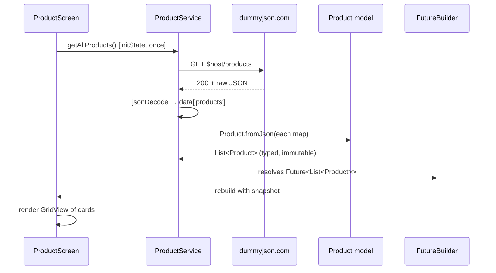

# Discussion: Model–Service–Screen Interaction and Design Patterns

**Project:** `marinas_advmobprog` — Flutter e-commerce app
**API endpoint:** `https://dummyjson.com/products`

---

## 1. Overview of the Layers

The app separates responsibility across three layers plus a configuration file. Each layer only knows about the one directly beneath it, and none of them knows about the one above.

| Layer         | File                                | Responsibility                                             | Knows about              |
| ------------- | ----------------------------------- | ---------------------------------------------------------- | ------------------------ |
| Configuration | `lib/constants.dart`                | Holds the API host, read from `.env`                       | `flutter_dotenv` only    |
| Model         | `lib/models/product.dart`           | Describes what a product _is_; converts JSON → Dart object | Nothing (pure Dart)      |
| Service       | `lib/services/product_service.dart` | Talks to the network; returns models                       | `http`, model, constants |
| Screen        | `lib/screens/product_screen.dart`   | Renders widgets; handles user input                        | Service and model        |

The important consequence of this ordering: **the model has no idea the internet exists, and the screen has no idea HTTP exists.** The screen never sees a URL, a status code, or a raw JSON map. It asks for a `Future<List<Product>>` and gets one.

---

## 2. How the API Endpoint Gets Rendered

### Step 1 — Configuration is loaded before the app starts

`lib/main.dart:20`

```dart
await dotenv.load(fileName: 'assets/.env');
runApp(const MarinasAdvMobProg());
```

`dotenv.load()` is awaited _before_ `runApp()`, so environment values are in memory before any widget builds. `lib/constants.dart:3` then exposes the host:

```dart
var host = dotenv.env['HOST'];
```

Keeping the base URL out of the source code means the endpoint can be changed without editing Dart, and the URL is not hard-coded into the widget tree.

> **Note:** because `runApp()` is on the line _after_ `await dotenv.load(...)`, a missing `assets/.env` throws and the app never renders at all. This is the layer's single point of failure.

### Step 2 — The screen requests data once, in `initState`

`lib/screens/product_screen.dart`

```dart
@override
void initState() {
  super.initState();
  _productsFuture = CartService().getCartProducts();
}
```

> **Enhancement 5 note.** This line used to read
> `ProductService().getAllProducts()`. The shop grid is now stocked from the
> **carts** endpoint instead of `/products`, so its tiles are `CartProduct`s.
> Nothing about the layering below changed — a different service, returning a
> different model, through the identical Future/`FutureBuilder` path. The
> `/products` walkthrough that follows still describes live code: it is what
> `ProductDetailsLoader` runs when you tap a tile, via
> `ProductService.getProductById()`.

This is deliberate and worth understanding. `build()` in Flutter can run many times — on every `setState`, rotation, theme change, or keystroke in the search bar. If the service call lived in `build()`, **every keystroke would fire a new HTTP request.**

By calling it once in `initState()` and storing the result in a `late final Future`, the network call happens exactly once for the life of the screen. The field is a `Future`, not a `List` — the screen holds a _promise_ of data, not the data itself.

### Step 3 — The service performs the request and delegates parsing

`lib/services/product_service.dart:7-16`

```dart
Future<List<Product>> getAllProducts() async {
  final response = await http.get(Uri.parse('$host/products'));
  if (response.statusCode == 200) {
    final Map<String, dynamic> data = jsonDecode(response.body);
    final List productsJson = data['products'] ?? [];
    return productsJson.map((json) => Product.fromJson(json)).toList();
  } else {
    throw Exception('Failed to load products');
  }
}
```

Four distinct jobs happen here:

1. **Build the URL** — `'$host/products'` combines config with the endpoint path.
2. **Check the response** — anything other than `200` throws instead of returning bad data.
3. **Decode the envelope** — DummyJSON wraps results in `{"products": [...], "total": …}`, so `data['products']` unwraps the array. `?? []` guards against a missing key.
4. **Delegate conversion** — `.map((json) => Product.fromJson(json))` hands each map to the model.

The critical detail is what the service _returns_: `List<Product>`, not `List<Map<String, dynamic>>`. **Untyped JSON stops here.** Past this boundary the app works only with typed objects.

The `throw` matters as much as the return. The service does not return `null` or an empty list on failure — it throws, which propagates through the `Future` and surfaces in the UI as `snapshot.hasError`.

### Step 4 — The model converts JSON into a typed object

`lib/models/product.dart:50`

```dart
factory Product.fromJson(Map<String, dynamic> json) {
  return Product(
    id: json['id'],
    title: json['title'],
    price: (json['price'] as num).toDouble(),
    ...
    dimensions: ProductDimensions.fromJson(json['dimensions']),
    reviews: (json['reviews'] as List)
        .map((i) => ProductReview.fromJson(i))
        .toList(),
    ...
  );
}
```

Three things are happening:

- **Type normalisation.** JSON has one number type; Dart distinguishes `int` from `double`. `(json['price'] as num).toDouble()` guarantees `price` is always a `double`, so `product.price.toStringAsFixed(2)` in the UI can never crash on an integer price like `9`.
- **Null-safety defaults.** `json['brand'] ?? ''` means the UI never has to null-check `brand` — important because the search filter calls `product.brand.toLowerCase()` directly.
- **Recursive composition.** Nested JSON objects get their own models — `ProductDimensions`, `ProductReview`, `ProductMeta` — each with its own `fromJson`. A nested array becomes `List<ProductReview>`, not `List<dynamic>`.

Because all fields are `final`, a `Product` is immutable: once built it cannot be silently modified by a widget.

### Step 5 — `FutureBuilder` renders whichever state the Future is in

`lib/screens/product_screen.dart:109-157`

```dart
FutureBuilder<List<Product>>(
  future: _productsFuture,
  builder: (context, snapshot) {
    if (snapshot.connectionState == ConnectionState.waiting) {
      return const CircularProgressIndicator();       // loading
    }
    if (snapshot.hasError) {
      return CustomText(text: 'Error: ${snapshot.error}');  // failed
    }
    final products = snapshot.data ?? [];
    if (products.isEmpty) { ... }                     // empty
    return GridView.builder(...);                     // success
  },
)
```

`FutureBuilder` subscribes to the `Future` and rebuilds automatically whenever its state changes. The screen never calls `setState` for the network result and never manually tracks an `isLoading` boolean — **the UI is a function of the Future's current state.**

Every possible state is handled explicitly: loading, error, empty, and success. The `Exception` thrown back in the service arrives here as `snapshot.error`.

### Step 6 — Widgets read typed properties

```dart
Image.network(product.thumbnail)
CustomText(text: product.title)
CustomText(text: '\$${product.price.toStringAsFixed(2)}')
```

By this point there is no JSON anywhere — just dot-access on a typed object, checked by the compiler. A typo like `product.titel` fails at compile time rather than rendering `null` at runtime.

### The complete flow



Direction of dependency:

```
constants.dart  ←  product_service.dart  →  product.dart
                            ↑                    ↑
                            └── product_screen.dart ──┘
```

Arrows only ever point _downward_. The model never imports the service; the service never imports a screen. This is what makes each layer independently testable and replaceable.

---

## 3. Design Patterns in This Activity

### 3.1 Provider / `ChangeNotifier` — the Observer Pattern (the new pattern)

The genuinely new pattern introduced here is **Provider**, which is Flutter's implementation of the classic **Observer pattern** (also called publish–subscribe).

The pattern has three participants:

**The Subject** — `lib/providers/theme_provider.dart:3`

```dart
class ThemeProvider with ChangeNotifier {
  bool _isDark = false;
  bool get isDark => _isDark;

  void toggleTheme() {
    _isDark = !_isDark;
    notifyListeners();   // ← broadcast to all observers
  }

  void setDarkMode(bool value) {
    if (_isDark == value) return;   // skip redundant rebuilds
    _isDark = value;
    notifyListeners();
  }
}
```

The state (`_isDark`) is private with a public read-only getter, so it can only change through the two methods — and both end in `notifyListeners()`. That call is the broadcast.

**The registration point** — `lib/main.dart:31`

```dart
return ChangeNotifierProvider(
  create: (_) => ThemeProvider(),
  child: ScreenUtilInit(...),
);
```

Placed above `MaterialApp`, this makes one shared instance visible to every descendant widget.

**The Observers** — `lib/main.dart:38` and `lib/screens/settings_screen.dart:21`

```dart
final themeModel = build.watch<ThemeProvider>();      // main.dart
final themeModel = context.watch<ThemeProvider>();    // settings_screen.dart
```

`watch()` both reads the value _and_ subscribes. When `notifyListeners()` fires, every widget that called `watch()` rebuilds — and only those widgets.

#### Why this pattern was necessary here

Enhancement 3 moved the dark/light switch from the home screen's app bar into a separate settings page. That created a concrete problem:

```
MaterialApp  ← needs to know isDark (to pick the theme)
 └── HomeScreen
      └── (pushed route) SettingsScreen  ← changes isDark
```

`SettingsScreen` is not a child of `MaterialApp` in a way that lets it pass a value back upward — and `MaterialApp` is the widget that actually _applies_ the theme (`main.dart:43`):

```dart
themeMode: themeModel.isDark ? ThemeMode.dark : ThemeMode.light,
```

With `setState` alone this is impossible without **prop drilling** — threading callbacks down through every intervening widget, plus `HomeScreen` → `Navigator.push` → `SettingsScreen`. Provider lets the switch in the settings page and the `MaterialApp` at the root communicate directly, with no widget in between knowing anything about it.

#### `setState` vs Provider — when each is correct

This app uses **both**, and the choice is deliberate:

|                | `setState`             | Provider              |
| -------------- | ---------------------- | --------------------- |
| Scope of state | One widget             | Across the whole tree |
| Used for       | Search text (`_query`) | Theme (`isDark`)      |
| Where it lives | `_ProductScreenState`  | `ThemeProvider`       |
| Rebuilds       | That widget's subtree  | Every `watch()`er     |

The search query in `product_screen.dart:29` stays as `setState` because **no other screen cares about it**. Promoting it to a Provider would add indirection for zero benefit. Theme is the opposite: two widgets in unrelated parts of the tree must agree on it.

The rule this demonstrates: _use the narrowest state mechanism that reaches every widget that needs the value._

#### One detail worth noticing

```dart
void setDarkMode(bool value) {
  if (_isDark == value) return;   // skip redundant rebuilds
  ...
}
```

The guard clause prevents `notifyListeners()` from firing when the value did not actually change. Without it, setting `false` over `false` would still rebuild every observer. This is a small but real performance habit in Observer implementations.

### 3.2 The Service Pattern (a step toward Repository)

`ProductService` isolates all network concerns behind a plain method call. The screen's entire knowledge of networking is one line:

```dart
_productsFuture = ProductService().getAllProducts();
```

The payoff is substitutability. Swapping DummyJSON for a different backend, adding caching, or returning fake data in a test requires editing only `product_service.dart` — `product_screen.dart` does not change by a single character.

This is the _Service_ form of the pattern. A full **Repository** would go further: define an abstract interface, then inject the implementation, so tests could supply a fake without touching production code. That is the natural next step.

### 3.3 Factory Constructor / DTO Mapping

`Product.fromJson` is a **factory constructor** — a named constructor that runs logic before producing an instance. It is the single place where the API's data shape is translated into the app's data shape.

This centralisation is the point. If DummyJSON renamed `thumbnail` to `image`, exactly one line changes. Without this pattern, every widget touching `json['thumbnail']` would need updating, and the compiler could not tell you where they all were.

### 3.4 Declarative Async UI (`FutureBuilder`)

`FutureBuilder` replaces the imperative pattern:

```dart
// imperative — not used here
bool isLoading = true;
List<Product> products = [];
void load() async {
  setState(() => isLoading = true);
  products = await service.getAllProducts();
  setState(() => isLoading = false);   // easy to forget on the error path
}
```

with a declarative one where each state maps to a widget. The imperative version's classic bug — an exception skipping the `isLoading = false` line and leaving a spinner forever — is structurally impossible with `FutureBuilder`, because the error state is a branch in `builder`, not a variable someone has to remember to reset.

### 3.5 Composition over Inheritance (`CustomText`)

`lib/widgets/custom_text.dart` wraps `Text` with project defaults (Poppins, sizing, weight) rather than subclassing it. Flutter's entire design favours composition, and the practical benefit here is that the font family is defined once — changing the app's typeface is a one-file edit.

---

## 4. How the Three Enhancements Fit the Architecture

| Enhancement           | Layers touched         | Why so contained                                                                                                                                       |
| --------------------- | ---------------------- | ------------------------------------------------------------------------------------------------------------------------------------------------------ |
| **1** — Search bar    | Screen only            | Filtering runs on the already-fetched list in `_filterProducts()`. No new endpoint, no service change, no model change. (Enhancement 5 narrowed it to titles, since cart items carry no brand or category.) |
| **2** — Details page  | Screen only (new file) | The tapped `Product` object is passed straight into `ProductDetailsScreen`. Because the model is already a typed object, no second API call is needed. |
| **3** — Settings page | Screen + Provider      | The only enhancement needing cross-tree state, and the only one that touched a non-UI layer.                                                           |

That two of three enhancements required **no change to the model or service** is the clearest evidence the layering works. Feature work stayed in the layer that owns presentation.

Enhancement 1 also illustrates a design decision made possible by the architecture: because the service already returned a complete typed list, search could be implemented **client-side**. Typing filters an in-memory list — instant, no network traffic per keystroke, and functional offline. The alternative would be calling DummyJSON's `/products/search?q=` on every change, which would mean a new service method, request debouncing, and a loading state per keystroke. Holding typed data in memory made the simpler option viable.

---

## 5. Summary

Rendering `https://dummyjson.com/products` passes through four transformations:

```
.env config → HTTP response → decoded JSON → typed Product objects → widgets
```

Each arrow is a layer boundary, and each boundary narrows the data's type. The screen receives only fully-formed, immutable, compiler-checked objects.

The **new pattern in this activity is Provider (`ChangeNotifier` + Observer)**, introduced because Enhancement 3 moved the theme switch into a separate route while the widget that applies the theme (`MaterialApp`) sits at the root of the tree. Observer solves exactly that class of problem: state that must be read in one place and mutated in another, with no direct relationship between them.

The broader lesson is that the app now uses **two state mechanisms chosen by scope** — `setState` for state confined to one widget (search text), Provider for state shared across the tree (theme). Recognising which situation you are in is the actual skill; reaching for Provider for everything is as much a mistake as avoiding it entirely.
